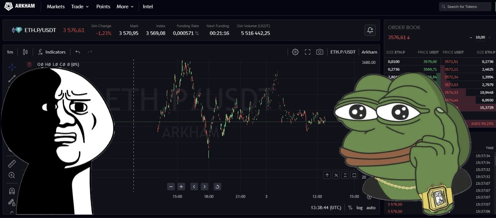

#  🚨 Arkham Auto-GUI 📈

Софт который поможет открывать - закрывать позиции, чтобы не кликать в ручную.
С помощью него вы сможете накрутить объемы для получения поинтов.

## 🔧 Подготовка:
- У вас должен быть зарегистрированный аккаунт на бирже Arkham
- У вас должен быть балланс на аккаунте
- Если у вас этого нет, в моем канале @vPoiskahGema вы найдете инструкцию как это сделать.

### ⚡ Инструкция:
- Откройте ваш браузер и перейдите на вкладку спотовой торговли (напр. https://arkm.com/trade/ETH_USDT)
- Нажмите раздел Market для торговле по маркету
- Запустите check-position.py, чтобы узнать координаты вашего курсора
- Откройте click-buy-sell.py и впишите в конфиге ваши координаты для каждой кнопки
- Остановите check-position.py и запустите click-buy-sell.py
- Проверяйте правильность кликов и попейте чаю пока софт крутит объемы

**❗️Так как торгуем по маркету, рекомендую торговать 200-500$, чтобы не было сильного проскальзывания**

## 🌍 in English

Software that will help you open - close positions, so you don't have to click manually.
With its help you will be able to scroll volumes to get points.

## 🔧 Preparation:
- You must have a registered account on Arkham Exchange
- You must have a balance in your account.
- If you don't have that, my channel @vPoiskahGema has instructions on how to do it.

### ⚡ Instructions:
- Open your browser and go to the spot trading tab (e.g. https://arkm.com/trade/ETH_USDT)
- Click on the Market section for spot trading
- Run check-position.py to find out the coordinates of your cursor
- Open click-buy-sell.py and write your coordinates for each button in the config.
- Stop check-position.py and run click-buy-sell.py
- Check the correctness of the clicks and have a cup of tea while the software spins the volumes.

**❗️ Since we are trading on the market, I recommend trading 200-500$, so that there is no strong slippage.**

